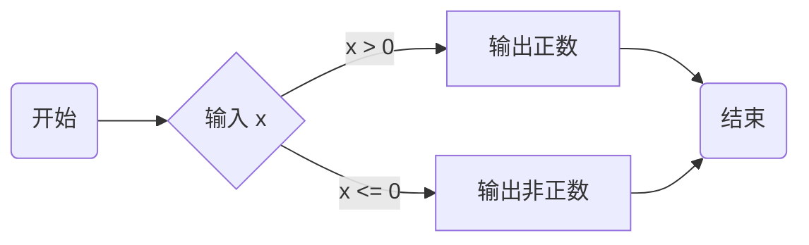

[B站视频链接](https://www.bilibili.com/video/BV1tNpbekEht?spm_id_from=333.788.videopod.sections&vd_source=71d8419b0e68a3c6bdaead698608818d)

### [g++测试](./test_gcc.c)

# [C语言基础](../C/knowledge_point.md)

# 数据结构

## 算法分析

### 时间复杂度

#### 定义：算法的运行时间随输入规模n增长而变化的趋势(**其关注的是增长速度，而不是具体的执行时间**)

程序运行的总时间和两点有关，执行每条语句的耗时，每条语句的执行次数;
ADT(abstract data type )类似于class一个说明书，不涉及具体对象

#### 大$O$表示法: $O(f(n))$ 表示当n很大时，算法运行时间的上界增长趋势

#### 忽略原则: 
- 忽略常数项
    $O(2n+10)→O(n)$
- 忽略低阶项
    $O(n^2+n)→O(n2)$

#### 增长速度示意:
$$\Large O(1)<O(logn)<O(n)<O(n \cdot logn)<O(n2)<O(2n)<O(n!)$$

#### 常见时间复杂度

| 时间复杂度 | 含义 | 典型场景 |
|:----------:|:------:|:---------:|
| $O(1)$ | 常数时间 | 数组下标访问 |
| $O(log(n))$ | 对数增长 | 二分查找 |
| $O(n)$ | 线性增长 | 遍历数组 |
| $O(n \cdot log(n))$ | 线性 × 对数 | 快速排序 / 归并排序 |
| $O(n^2)$ | 平方增长 | 冒泡排序 / 选择排序 |
| $O(2^n)$ | 指数增长 | 递归枚举 |
| $O(n!)$ | 阶乘增长 | 全排列 |

#### 最好/最坏/平均时间复杂度

##### 最好情况

算法运行最快的情况
例如：顺序查找第一个元素就命中 → $O(1)$
##### 最坏情况(最常用)

算法运行最慢的情况
例如：顺序查找查到最后 → $O(n)$
##### 平均情况

所有情况的数学期望
较难计算，工程中较少精确使用

## 线性表

### [顺序表](./sequence_list.c)

定义：由n个数据类型相同的元素构成的有限序列，称为线性表

特点：除第一个和最后一个元素之外，只有一个前驱和一个后继
创建，尾部添加， 遍历， 插入
顺序表插入数据的最好时间复杂度和最坏时间复杂度

### [链表](./linked_list.c)

定义：一组任意的存储单元存储线性表的数据元素(可以是连续的，也可以是不连续的)

特点：对数据元素$a_i$来说，除了其本身的信息之外，还需要存储一个知识其直接后继的信息。**这两部分信息组成数据元素$a_i$的存储映像，称为节点(node)**包括：**数据域**和**指针域**

#### [链表例题](./appilication_of_linedlist_2019.c)

## 树

### 树的定义：树是一个或多个结点的有限结合

结点：树中的一个独立单元

结点的度：结点拥有的子树数称为结点的度

树的度：树内各结点度的最大值

叶子：度为结点

非终端结点：度不为0的结点

双亲和孩子：结点的子树的根称为该结点的孩子；相应地，该结点称为孩子的双亲

层次：结点的层次从根开始定义，根为第一层，根的孩子为第二层，以此类推。

### 树的基本性质

1. 树中所有结点数等于所有结点的度数之和加1
   
>例：[2010]5.在一棵度为4的树T中，若有20个度为4的结点，10个度3的结点，1个度为2的结点，10个度为1的结点，则树T的叶子结点个数是$T_0$
>$$
\begin{aligned}
& S = 20*4 + 10*3 + 1*2 + 10*1 + 1 = 123 \\
& S = T_0 + 20 + 10 + 1 + 10 \\
& T_0 = 82
\end{aligned}
>$$
2. 对于度为$m$的树，第$i$层最多有$m^{i-1}$个节点
3. 对于高度为$h$，度为$m$的树，最多有$(m^h-1)/(m-1)$个结点
4. 如果二叉树有偶数个结点，说明，有一个度为1的结点

## 二叉树

### 二叉树的定义
二叉树(Binary tree)是n个结点所构成的集合，它或为空树，或为非空树。对于非空树T：

1. 有且仅有一个称为根的结点
2. 除跟结点意外的其余结点分为两个互不相交的子集$T_1$和$T_2$，分别称为T的左子树和右子树，且$T_1$和$T_2$本身又是二叉树
3. 二叉树的每个结点至多只有两棵子树
4. 子树有左右之分，其次序不能任意颠倒

### 二叉树的基本性质

1. 二叉树第$i$层最多有$2^{i-1}$个节点
2. 深度为$k$的二叉树最多有$2^i-1$个节点
3. 对于任何非空的二叉树T，如果叶子结点(度为0)的个数为$n_0$，而度为2度结点数为$n_2$，则$n_0=n_2+1$

### 满二叉树

### 完全二叉树

> **没有左子树，不能有右子树，上一层没有铺满，不能有下一层**

> 例：若一个完全二叉树有768个结点，则该二叉树中叶结点的个数是

>$$
n=n_0+n_1+n_2\\
n_0=n_2+1\\
当前叉树有偶数个结点，说明，有一个度为1的结点(n_1=1)\\
768=n=n_0+1+(n_0-1)\\
n_0=768/2=384
$$

