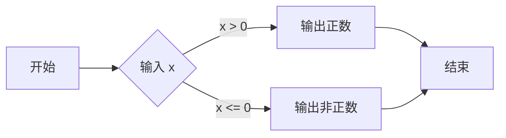

| 元素 | 语法 | 说明 |
|------|------|------|
| 节点 | `A[矩形]` `B((圆形))` `C{菱形}` | `[ ]` 矩形（过程） `(( ))` 圆形（开始/结束） `{ }` 菱形（判断） |
| 连接线 | `A --> B` | 实线箭头 |
|          | `A --- B` | 无箭头线 |
|          | `A -.-> B` | 虚线箭头 |
| 标签 | `A -->|标签| B` | 在线上加文字 |

换行：在节点文本中用` `换行