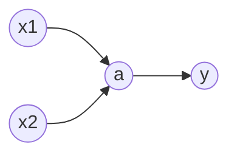

# 从函数到神经网络
问题的一一对应：`input -> function -> output`函数表示一切(符号主义)

复杂问题无法实现，使用近似，即猜和简化(连结主义)

> 激活函数g(x):将线性关系转变为非线性关系$f(x)=g(kx+b)$
> $$ y(z)=1/(1+e^{-z});  ReLU(z)=max(0,z);$$
> 激活函数的叠加:
> $$g(k_3g(k_1x_1+k_2x_2+b)+b)$$

从 输入层->隐藏层->输出层 的过程叫做**前向传播**

# 计算神经网络的参数

计算预测数据和真实数据之间误差的函数叫做**损失函数**

均方误差(MSE): $L=\frac{1}{N} \sum_{i=1}^{N} (y_i - \hat{y}_i)^2$ 表示真实值和预测值的误差

>例：已知四个数据:(1,1)(2,2)(3,3)(4,4) 模型: $y=\omega x$ 损失函数使用均方误差 求解让L最小的$\omega$
>
>$$L=\frac{1}{N} \sum_{i=1}^{N} (y_i - \omega x_i)^2=\frac{1}{4} [(1-1\omega)^2+(2-2\omega)^2+(3-3\omega)^2+(4-4\omega)^2]=7.5-15\omega+7.5\omega ^2$$
>$$L'(\omega)=-15+15\omega=0;\omega=1$$
线性回归：通过寻找一个函数来拟合$x$和$y$的关系
>$$\omega=\omega-\eta\frac{\partial L(\omega,b)}{\partial \omega}$$
>$$b=b-\eta\frac{\partial L(\omega,b)}{\partial \omega}$$
>其中$\eta$就叫做**学习率**;两个偏导数叫做$L(\omega,b)$的**梯度**;

不断调整$\omega$和$b$让损失函数不断减小的过程进而最终求出$\omega$和$b$就叫做**梯度下降**

在 输入层->隐藏层->输出层 中使用链式求导法则求出偏导数;反向传播:从输出层到输入层一步一步确定参数

# 调神经网络的方法

鲁棒性(robustness):模型不因输入的一点点的小的变化而对输出产生大的变化
正则化:在损失函数中添加惩罚项来抑制参数野蛮增长
$$ [L1正则化] 新损失函数 = 损失函数+(正则化系数)\lambda(\sum_{i=1}^{N} |\omega _i|) [惩罚项]$$
$$ [L2正则化] 新损失函数 = 损失函数+(正则化系数)\lambda(\sum_{i=1}^{N} {\omega _i}^2) [惩罚项]$$
超参数:控制参数的参数;如$\lambda$
dropout:每次训练都随机丢弃一部分参数
梯度消失:网络越深，梯度的反向传播越来越小，参数更新困难(残差网络)
梯度爆炸:梯度数值越来越大，失去控制
收敛速度:陷入局部最优活着来回震荡

# 从矩阵到CNN

全连接层

# 从词嵌入到RNN